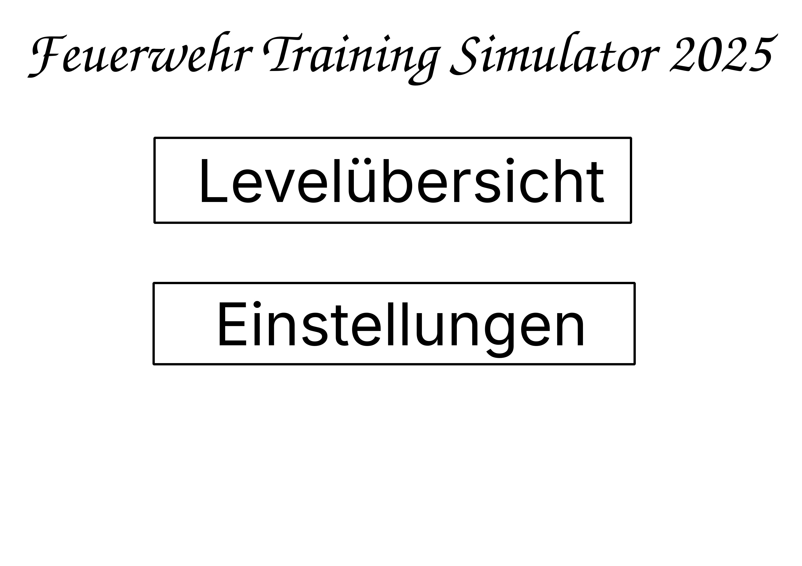
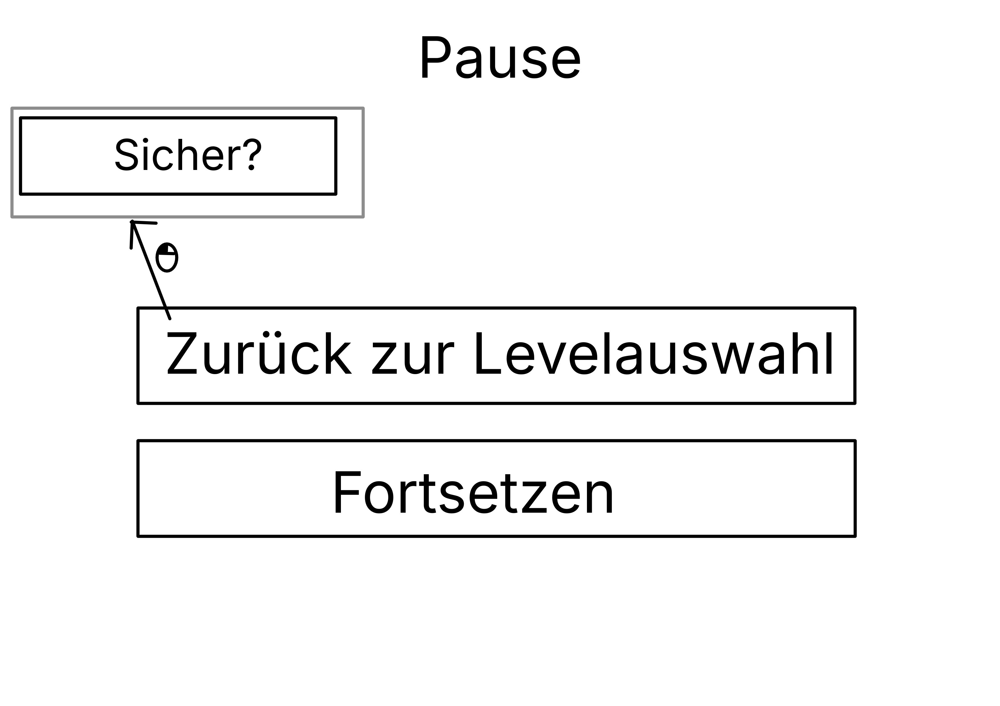
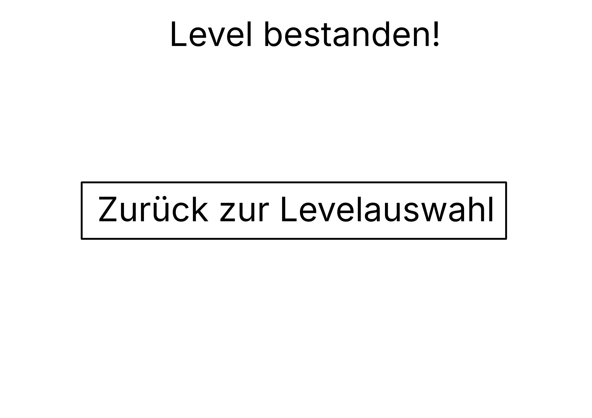
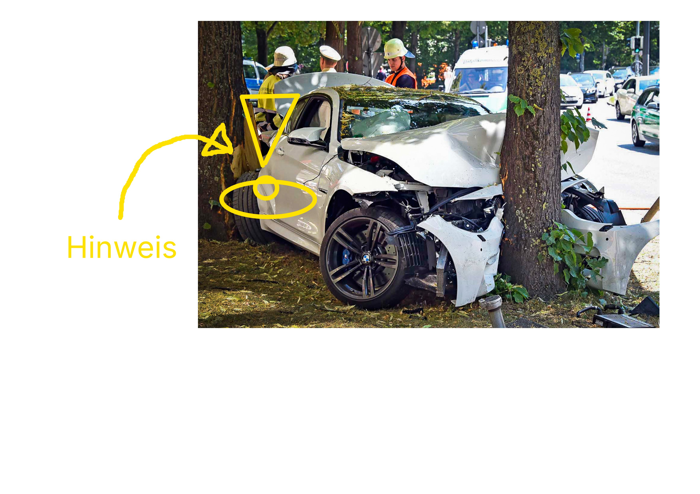

# Storyboard Feuerwehr-Trainings-Game

## Übersicht
Wir entwickeln ein Spiel für das Training von Feuerwehrleuten, in dem die Rettung von Personen aus PKWs geübt wird. 

Im Spiel übt man Türen von verunfallten Personenkraftwagen zu öffnen, um diese zu befreien. Im Besonderen geht es um die Verwendung von (Hydraulik-)Werkzeugen (unter anderem von Weber Rescue) für diese Aufgabe. 

## Aufbau des Spiels / UI-Flow

### Startbildschirm 
Auf dem Startbildschirm gibt es Knöpfe um zu den Einstellungen und zu den Leveln zu gelangen.

### Einstellungen
Hier kann man die Einstellungen des Spiels anpassen. Dazu zählt z.B. die Lautstärke des Spiels und ob man Hinweise angezeigt bekommt.  

Von den Einstellungen kann man auch zurück zum Startbildschirm gelangen. 

### Levelauswahl
Hier kann man ein Level auswählen, das man spielen möchte. Angezeigt wird die Schwierigkeit, eine kurze Beschreibung und der Name des Levels. Durch die Auswahl eines Levels verlässt man die Übersicht und das entsprechende Level wird geladen. 

Von der Level-Übersicht kann man auch zurück zum Startbildschirm gelangen. 

### Level 
Startet man ein Level, landet man in einer Umfallumgebung mit einem verunfallten PKW. 
Hat man ein Level erfolgreich beendet, erscheint ein Menü in dem der spielenden Person zum Abschluss des Levels gratuliert wird.  Über einen entsprechend Knopf kann man zur Level-Übersicht zurückkehren. 

Von einem Level aus kann man das Spiel pausieren, und gelangt so in das Pause-Menü. 

### Pause-Menü
Im Pause-Menü kann man das Spiel beenden, zum Startbildschirm zurückkehren und die Einstellungen öffnen, jeweils über einen entsprechenden Knopf. Auch kann das Spiel fortgesetzt werden, das Pause-Menü wird dann geschlossen und man ist zurück im Level. 

## Im Level 
Man hat eine Auswahl an Werkzeugen die man ausrüsten kann, um so die Tür des Wagens zu öffnen. 
Um ein Level erfolgreich abzuschließen, muss eine verunfallte Person (eventuell mehrere) aus einem PKW befreit werden. 

Um im Level voranzuschreiten muss eine Reihe von Schritten durchgeführt werden. 
Sind Hinweise angeschaltet, so wird durch visuelle Markierungen ein Hinweis gegeben, welcher Schritt als nächstes durchzuführen ist. 

